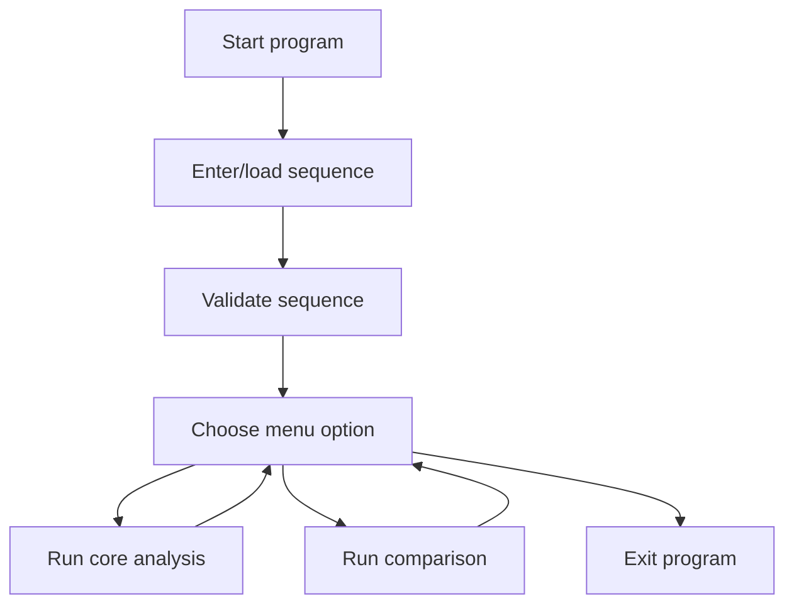

```mermaid
flowchart TD
    A[Start program] --> B[Enter/load sequence]
    B --> C[Validate sequence]
    C --> D[Choose menu option]
    D --> E[Run core analysis]
    D --> F[Run comparison]
    D --> G[Exit program]
    E --> D
    F --> D
```
